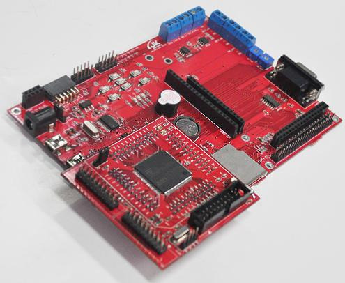

# STM32F103VCT6 MCU HAL CODE

## 프로젝트 소개
JK전자에 STM32 Dragon Board HAL 코드 예제

## 주요 기능
#### GPIO 제어를 통한 LED 제어
#### 버튼을 통한 LED 점멸 제어

## 개발 환경
#### STM32CubeMX
#### Keil Version 5
#### Visual Studio Code

   

